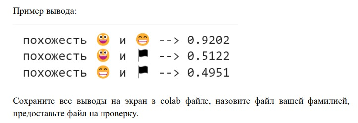
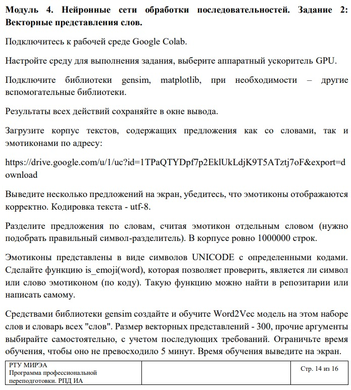
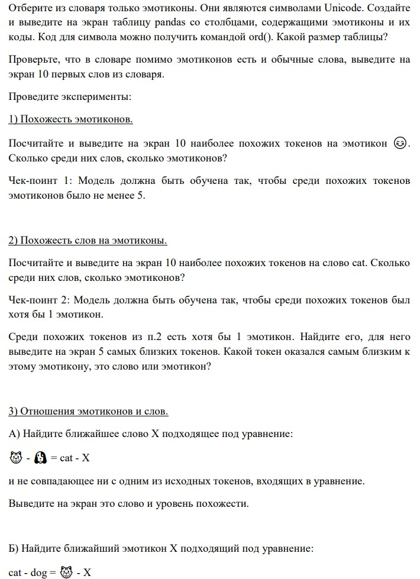

# Laboratory work on ML and DS
(As part of the additional courses at RTU MIREA)
___
## List of topics: 
1. Logistic regression
2. Clustering
3. Radial basis network and auto-differentiation
4. Vector representations of images
5. Vector representations of words

___
## Description of the works: 
Tasks one through three are devoted to basic machine learning and data processing algorithms.

### 1.Logistic regression


Important stages:
1. Data separation, model creation and training
```python
X_train, X_test, y_train, y_test = train_test_split(X, y, test_size=0.3, random_state=42)

# Создаем модель логистической регрессии
model = LogisticRegression(solver='lbfgs', multi_class='multinomial', max_iter=2000)

# Обучаем модель на обучающей выборке
model.fit(X_train, y_train)
```

2. we use a statistical method to reduce the dimension of the vectors
```python
# Цикл по различным размерностям
for n_components in n_components_list:
    # Замеряем время начала
    start_time = time.time()

    # Создаем модель PCA
    pca = PCA(n_components=n_components)

    # Проецируем данные на меньшее пространство
    X_train_pca = pca.fit_transform(X_train)
    X_test_pca = pca.transform(X_test)
```

[Decision](https://colab.research.google.com/drive/1SI3h2kDAfLKaO5yWJcgBK9BoT2Id60mH)

### 2.Clustering


Important stages:
1. Clustering of data sets by 3 methods
```python
# Генерация тестовых данных
X, y_true = generate_data_A(inner_radius, outer_radius, num_points1, num_points2)

# К-средних
kmeans = KMeans(n_clusters=2, random_state=42)  # 2 кластера
kmeans.fit(X)
y_pred_kmeans = kmeans.labels_
rand_index_kmeans = rand_score(y_true, y_pred_kmeans)
print(f"Rand Index для K-средних: {rand_index_kmeans}")

# DBSCAN
dbscan = DBSCAN(eps=1, min_samples=5)  # Подбор гиперпараметров
dbscan.fit(X)
y_pred_dbscan = dbscan.labels_
rand_index_dbscan = rand_score(y_true, y_pred_dbscan)
print(f"Rand Index для DBSCAN: {rand_index_dbscan}")

# Gaussian Mixtures
gmm = GaussianMixture(n_components=2, random_state=42)  # 2 компоненты смеси
gmm.fit(X)
y_pred_gmm = gmm.predict(X)
rand_index_gmm = rand_score(y_true, y_pred_gmm)
print(f"Rand Index для Gaussian Mixtures: {rand_index_gmm}")
```

[Decision](https://drive.google.com/file/d/1hkspudxL7MuXPmzbWjdFgMbulWy12Kxy/view?usp=sharing)

### 3.Radial basis network and auto-differentiation


Important stages:
1. Initializing the main class
```python
class RBF(nn.Module):
    def __init__(self, input_dim, hidden_dim, output_dim):
        super(RBF, self).__init__()
        self.input_dim = input_dim
        self.hidden_dim = hidden_dim
        self.output_dim = output_dim

        # Обучаемые параметры
        self.centers = nn.Parameter(torch.randn(hidden_dim, input_dim))
        self.gammas = nn.Parameter(torch.ones(hidden_dim))  # Ширина RBF, обучаемая
        self.weights = nn.Parameter(torch.randn(hidden_dim, output_dim))

        # Линейный слой для выходного слоя
        self.linear = nn.Linear(hidden_dim, output_dim)
```

2. Model Training
```python
def train_model(model, X_train, y_train, optimizer, criterion, epochs=100):
    train_losses = []
    for epoch in range(epochs):
        # Прямой проход
        output = model(X_train)
        loss = criterion(output, y_train)

        # Обратный проход
        optimizer.zero_grad()
        loss.backward()

        # Обновление параметров
        optimizer.step()

        train_losses.append(loss.item())

        if (epoch + 1) % 10 == 0:
            print(f'Epoch {epoch + 1}, Loss: {loss.item():.4f}')

    return train_losses
```

3. Quality assessment
```python
def evaluate_model(model, X_test, y_test):
    with torch.no_grad():
        output = model(X_test)
        predicted = torch.argmax(output, dim=1)

        # Преобразование y_test в тензор PyTorch, если необходимо
        if not isinstance(y_test, torch.Tensor):
            y_test = torch.tensor(y_test)

        # Теперь y_test точно тензор PyTorch, поэтому мы можем использовать его для сравнения
        accuracy = (predicted == y_test).float().sum().item() / len(y_test)
        return accuracy
```

[Decision](https://drive.google.com/file/d/1gXNOKyPTBhl45HCVmkLz2Tb39uU-M2oV/view?usp=sharing)

___
Tasks 4 and 5 are devoted to neural network data analysis.
### 4. Vector representations of images



Important stages:
1. Converting an image to a vector
```python
def image_to_vector(image_path, model_name="VGG16", target_size=(64, 64)):
  # Загрузка модели
  if model_name == "VGG16":
    model = VGG16(weights="imagenet", include_top=False)
  else:
    raise ValueError("Неподдерживаемая модель: {}".format(model_name))

  # Загрузка и пред обработка изображения
  img = image.load_img(image_path, target_size=target_size)
  x = image.img_to_array(img)
  x = preprocess_input(x)
  x = tf.expand_dims(x, axis=0)

  # Извлечение признаков
  features = model.predict(x)

  # Преобразование признаков в вектор
  vector = features.flatten()

  return vector
```

2. Calculating the cosine similarity of vectors
```python
def cosine_similarity(vector1, vector2):
  # Вычисляем скалярное произведение векторов
  dot_product = np.dot(vector1, vector2)

  # Вычисляем норму векторов
  norm_vector1 = np.linalg.norm(vector1)
  norm_vector2 = np.linalg.norm(vector2)

  # Вычисляем косинусную схожесть
  cosine_similarity = dot_product / (norm_vector1 * norm_vector2)

  return cosine_similarity
```

[Decision](https://drive.google.com/file/d/1V0_f2lEjXg7lbHifr99MLHt20aHPwTb0/view?usp=sharing)

### 5. Vector representations of words




Important stages:
1. Tokenize:
```python
def tokenize(text):
    return re.findall(r'\w+|[^\w\s]', text, re.UNICODE)
```

2. Model Training
```python
sentences_tokenized = [tokenize(sentence) for sentence in sentences]
start_time = time.time()
model = Word2Vec(sentences=sentences_tokenized, vector_size=300, window=5, min_count=5, workers=4)
training_time = time.time() - start_time
print(f'Время обучения: {training_time:.2f} (сек)')
```

3. Data visualization: 
```python
plt.figure(figsize=(12, 6))
plt.subplot(1, 2, 1)
plt.scatter(pca_result[:, 0], pca_result[:, 1])
for i, txt in enumerate(emoji_list):
    plt.annotate(txt, (pca_result[i, 0], pca_result[i, 1]), fontsize=8)
plt.title('PCA')

plt.subplot(1, 2, 2)
plt.scatter(tsne_result[:, 0], tsne_result[:, 1])
for i, txt in enumerate(emoji_list):
    plt.annotate(txt, (tsne_result[i, 0], tsne_result[i, 1]), fontsize=8)
plt.title('TSNE')

plt.show()
```

[Decision](https://colab.research.google.com/drive/1prmPuVWd4DqnOu23IIQmkigg6JUuqiRs?usp=sharing)
